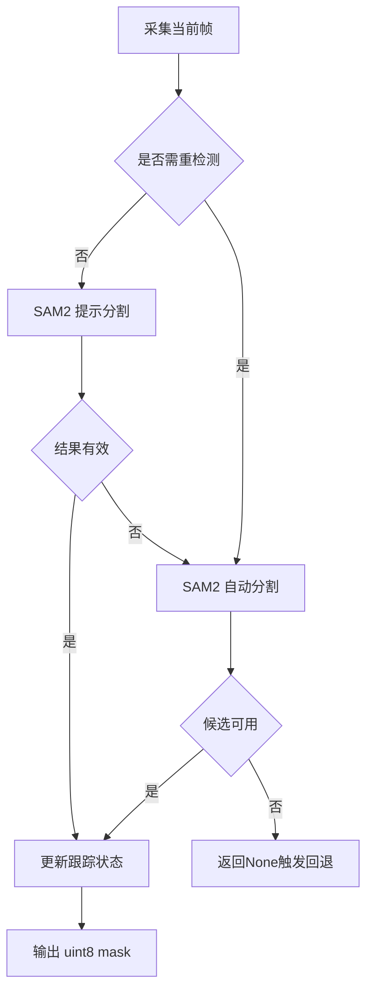

# SAM2 替换 URDF mask 流程实施计划

## 1. 目标与边界

- 目标
  - 将 [`infer_mask`](../eval_mask_final.py) 的掩码来源从 URDF 渲染切换为 SAM2 在线分割
  - 保持 [`_safe_infer_mask`](../eval_mask_final.py) 到下游 [`mask01`](../eval_mask_final.py) 的接口不变
  - 保留现有 mask-aware 回退策略与统计输出

- 非目标
  - 不改动策略模型结构与动作推理主干
  - 不引入视频全集预加载模式

## 2. 现状分析

当前流程关键点
- 初始化 URDF renderer 在 [`evaluate`](../eval_mask_final.py) 的 mask-aware 初始化分支
- 掩码生成在 [`infer_mask`](../eval_mask_final.py)
- 下游依赖
  - [`_normalize_mask01`](../eval_mask_final.py)
  - 3D 过滤
  - 2D reweight
  - 回退日志与统计

问题
- URDF mask 对模型泛化无增益
- 目标是统一为视觉分割链路

## 3. 方案概述

采用 SAM2 图像在线分割两阶段状态机

- 阶段 A 重检测
  - 周期性在当前帧执行自动分割
  - 选择最可能机械臂的候选 mask 作为锚点

- 阶段 B 帧间跟踪
  - 使用上一帧锚点转换出的提示 在当前帧执行快速分割
  - 通过 bbox 与点提示维持稳定输出

- 失败回退
  - 触发重检测
  - 若仍失败返回 None 复用原有 no_mask_fallback



## 4. 代码改造清单

### 4.1 新增 SAM2 配置构建

在 [`eval_mask_final.py`](../eval_mask_final.py) 增加配置构建函数
- `_build_sam2_cfg`
- 配置项建议
  - `enabled`
  - `config_file`
  - `ckpt_path`
  - `device`
  - `auto_every_n_steps`
  - `min_area_ratio`
  - `max_area_ratio`
  - `max_track_failures`
  - `prompt_num_pos_points`
  - `prompt_num_neg_points`

兼容策略
- 若配置缺失则自动 fallback 为关闭
- 若 `enabled=true` 且 ckpt 不可用则 fail fast 报错

### 4.2 新增 SAM2 全局状态

新增模块级状态
- `_sam2_runtime`
  - `sam_model`
  - `img_predictor`
  - `auto_mask_generator`
  - `last_mask`
  - `last_bbox`
  - `last_step`
  - `track_fail_count`

### 4.3 初始化替换

在 [`evaluate`](../eval_mask_final.py)
- 删除 URDF renderer 初始化逻辑
- 增加 SAM2 初始化函数调用
  - 通过 [`build_sam2`](../sam2/build_sam.py) 构建模型
  - 构建 [`SAM2ImagePredictor`](../sam2/sam2_image_predictor.py)
  - 构建 [`SAM2AutomaticMaskGenerator`](../sam2/automatic_mask_generator.py)

### 4.4 infer_mask 主体替换

保持签名不变
- `infer_mask color depth proprio meta agent`

内部流程
1. 参数与颜色格式标准化
2. 判断是否重检测
3. 若重检测
   - 自动分割
   - 候选筛选
   - 更新 runtime 状态
4. 若跟踪
   - 从 `last_mask` 生成 bbox 与点提示
   - 调用 image predictor
   - 有效性校验
5. 输出 uint8 mask

### 4.5 候选选择与稳定性

新增辅助函数
- `_mask_to_bbox`
- `_sample_prompt_points`
- `_is_mask_valid`
- `_choose_best_candidate`

选择准则
- 面积比在阈值区间内
- 与上一帧 mask IoU 最大优先
- 无历史时按面积与中心先验

### 4.6 统计与可视化

保留并扩展 `mask_stats`
- 新增
  - `sam2_auto_fail`
  - `sam2_track_fail`
  - `sam2_reinit`

保留现有 `_save_mask_visualization`

## 5. 配置示例

在部署 yaml 新增

```yaml
mask_aware:
  enabled: true
  enable_3d_filter: true
  enable_2d_reweight: true
  mask_threshold: 0
  mask_white_is_untrusted: true
  infer_none_policy: no_mask_fallback
  empty_cloud_policy: warn_and_skip_filter

  sam2:
    enabled: true
    config_file: configs/sam2.1/sam2.1_hiera_b+.yaml
    ckpt_path: checkpoints/sam2.1_hiera_base_plus.pt
    device: cuda
    auto_every_n_steps: 15
    min_area_ratio: 0.005
    max_area_ratio: 0.4
    max_track_failures: 3
    prompt_num_pos_points: 12
    prompt_num_neg_points: 16
```

## 6. 风险与缓解

- 风险 A 首帧自动分割选错目标
  - 缓解 周期重检测 + IoU 连续性筛选

- 风险 B 跟踪漂移
  - 缓解 失败计数超阈值强制重检测

- 风险 C 实时性下降
  - 缓解 自动分割降频 跟踪高频

- 风险 D 光照变化导致 mask 抖动
  - 缓解 面积与形态有效性门控

## 7. 验收标准

- 在本地部署链路中无 URDF 依赖
- 能持续输出 `mask01` 到现有 3D 与 2D 分支
- 回退统计可观测且不会中断主循环
- 可视化输出可用于核验掩码稳定性

## 8. 实施顺序

1. 加入 SAM2 配置解析与日志摘要
2. 替换初始化阶段为 SAM2 runtime
3. 替换 `infer_mask` 及其辅助函数
4. 清理 URDF 相关代码
5. 运行静态检查并给出使用说明
